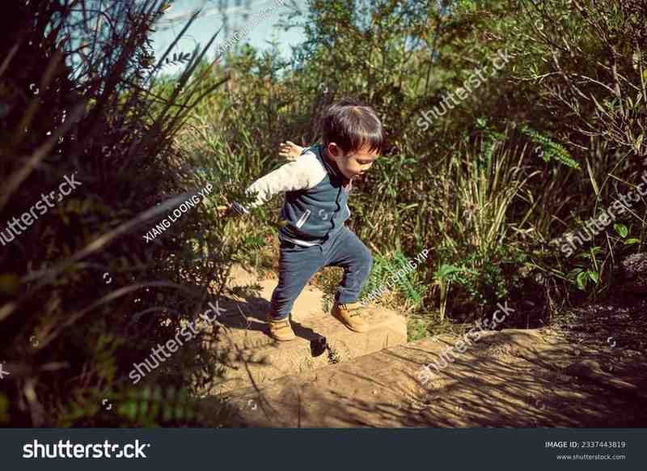
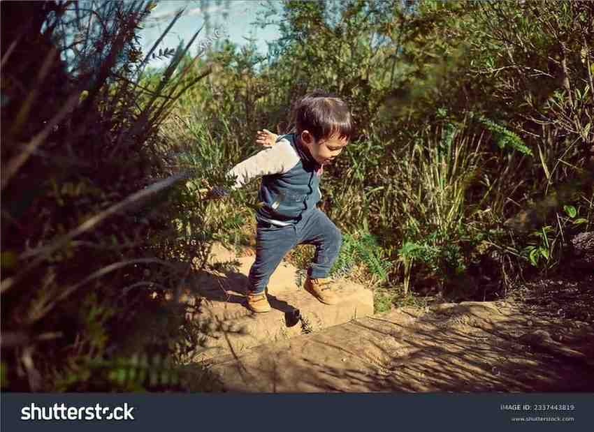
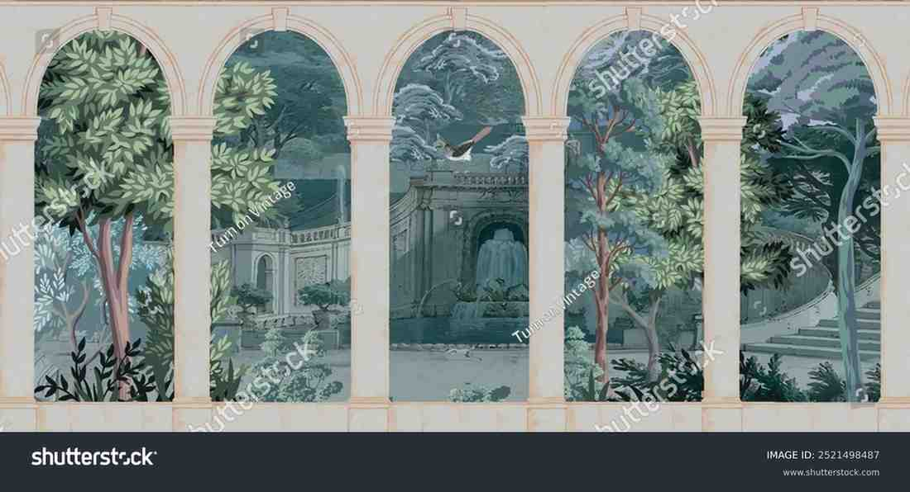
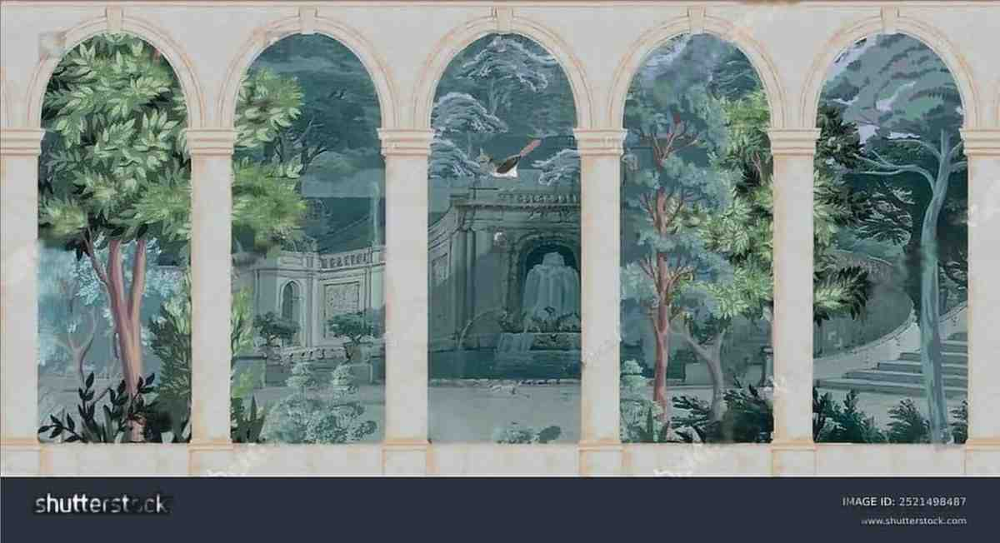
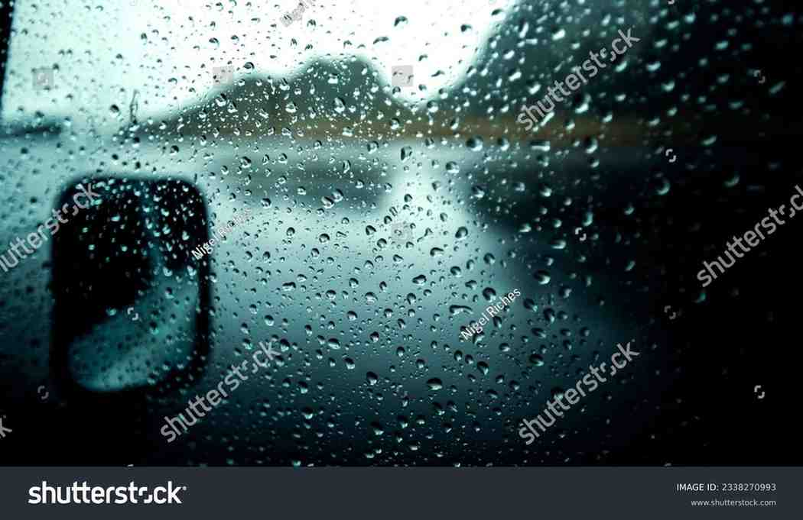
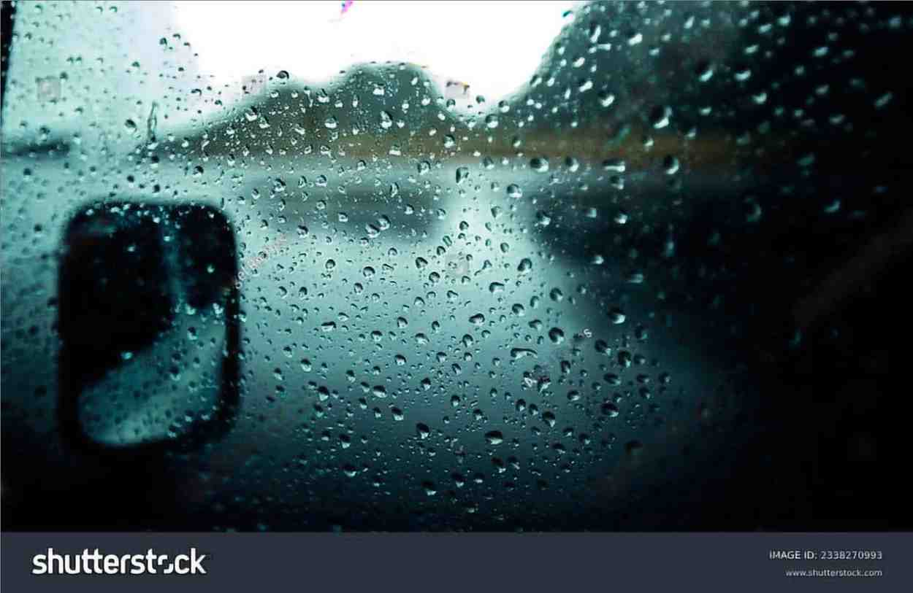

# Watermark‑Remover (GAN‐based, Patch‑wise)

> Patch‑based adversarial model that learns to **erase watermarks** from images of any size.  
> Combines a Res‑UNet generator, a spectral‑norm PatchGAN discriminator, and VGG‑19 perceptual loss.

---

## ✨ Sample Results

Here's a glimpse of the model's watermark removal capabilities:

| Before (Watermarked) | After (Restored by Model) |
| :------------------: | :-----------------------: |
|  |  |
|  |  |
|  |  |
|  |  |

#### 🔗 Live Demo

Try the model directly in your browser at:  
👉 [**WM-Remover on Hugging Face Spaces**](https://huggingface.co/spaces/b-aryan/WM-Remover)

You can upload or paste a link to a watermarked image, and the model will return a (mostly) clean, restored version.

---

## ✨ Key Features
| Feature | Why it matters |
|---------|---------------|
| **Res‑UNet Generator** – 4‑level encoder/decoder with 9 residual blocks (stochastic‑depth)| Preserves spatial detail while boosting capacity. |
| **Single‑scale PatchGAN Discriminator** | Penalises local artefacts without over‑parameterisation. |
| **Perceptual + L1 + GAN losses** | Balances pixel fidelity with perceptual realism. |
| **Patch‑wise training** (`256 × 256` kernels, `64` px stride) | Handles arbitrarily large images; smaller GPU footprint. |
| **Albumentations pipeline** | Real‐world JPEG, noise, motion blur, flips, etc. |
| **AMP + gradient clipping + schedulers** | Stable, mixed‑precision training out of the box. |

---

## 📂 Directory Layout

```text
.
├── dataset-smol/              # default sample dataset (see below)
│   ├── mark/                  # watermarked images  →  {id}_c.jpg
│   └── nomark/                # pristine targets    →  {id}_r.jpg
├── cropper.py                 # optional pre‑processor to align pairs
├── dataset.py                 # WatermarkPatchDataset  (patch extraction)
├── generator_model.py         # Res‑UNet G
├── discriminator_model.py     # PatchGAN D
├── vgg_loss.py                # perceptual loss (VGG‑19)
├── config.py                  # all tunables live here
├── train.py                   # main training script
├── utils.py                   # checkpoint helpers
├── run_on_patches_online.py   # Doing inference
└── README.md
```
## 🏗️ Model Architecture

| Component | Design | Rationale / Diff. vs Pix2PixHD |
|-----------|--------|--------------------------------|
| **Generator (Res‑UNet)** | • 7×7 reflection‑padded stem<br>• **Encoder:** four down‑sampling blocks (`64 → 1024` channels) – each 3×3 conv + BN + ReLU, stride 2<br>• **Bottleneck:** 9 ResidualBlocks with **stochastic depth p = 0.8**<br>• **Decoder:** nearest‑neighbour up‑sample → 3×3 conv (stride 1) with UNet skip‑concats<br>• Final 7×7 conv + tanh | • Keeps Pix2PixHD’s residual core but drops multi‑scale encoder; uses a shallower 4‑level UNet to preserve fine structure.<br>• Stochastic depth regularises the deep residual stack (absent in Pix2Pix/HD).<br>• Uses NN‑upsample + conv to avoid checker‑board artefacts from transposed conv. |
| **Discriminator (Spectral‑Norm PatchGAN)** | • Concatenates input & target (6 ch) → 3×3 conv stack: 64 → 1024 ch, stride 2 every other block<br>• Spectral‑norm on **every** conv layer | • Single‑scale only (Pix2PixHD uses 3); halves VRAM and speeds training.<br>• SpectralNorm replaces WeightNorm for stronger Lipschitz control. |
| **Losses** | **ℒ<sub>GAN</sub>**: BCE on D’s patch logits<br>**ℒ<sub>1</sub>**: pixel fidelity<br>**ℒ<sub>perc</sub>**: multi‑layer VGG‑19 (slices 1‑5) with layer‑wise weights 1/32…1 | Matches Pix2PixHD recipe, but weights are exposed in `config.py` for easy tuning. |
| **Patch Training Strategy** | Extracts 256×256 patches with 64 px stride (see `WatermarkPatchDataset`) so the model can handle arbitrarily large images on 8 GB GPUs. | Pix2PixHD trains on full images; patch‑wise training yields more updates per epoch and sharper watermark localisation. |

### Why this matters
* **Sharper restoration** – residual depth + perceptual loss remove ghosts without over‑smoothing.  
* **Stable training** – spectral‑norm, stochastic depth, AMP, and a cosine LR scheduler keep GAN loss curves smooth.

> **TIP:** To tweak capacity, change `features` (base channel count) and `num_residuals` in `generator_model.py`; everything else scales automatically.


## 🏋️ Training Details

Training was on [Kaggle Platform](https://kaggle.com) using their `T4x2 GPUs`.

- **Input Size**: 256 × 256 patches  
  Extracted from larger images using a custom `WatermarkPatchDataset`. Clean targets are resized using `LANCZOS` to match watermarked patch dimensions.

- **Optimizer**:
  - Generator: `Adam` (lr = `2e-4`, betas = `(0.5, 0.999)`)
  - Discriminator: `Adam` (same settings)

- **Schedulers**:
  - **ReduceLROnPlateau** for both Generator and Discriminator
  - Patience: 2 epochs without improvement triggers LR reduction

- **Loss Functions**:
  - **L1 Loss** (pixel-wise)
  - **GAN Loss**: Binary Cross Entropy with logits
  - **Perceptual Loss**:
    - Uses pretrained **VGG19** from PyTorch
    - Slices features at layers `[1, 6, 11, 20, 29]`
    - Layer weights: `[1/32, 1/16, 1/8, 1/4, 1]`

- **Mixed Precision Training**:
  - Enabled via `torch.cuda.amp` for both Generator and Discriminator
  - Helps reduce memory footprint and accelerate training

- **Batch Size**: Configurable (default = 8)

- **Epochs**: Configurable

- **Checkpointing**:
  - Generator and Discriminator weights saved every few epochs
  - `utils.py` provides `save_checkpoint()` and `load_checkpoint()` for resuming training

> Training is done patch-wise to generalize across various image resolutions and enhance local feature restoration.

## 🚀 Inference

This model is designed to handle arbitrarily large images by processing them in **overlapping patches** and seamlessly reconstructing the output using `run_on_patches_online.py`.

